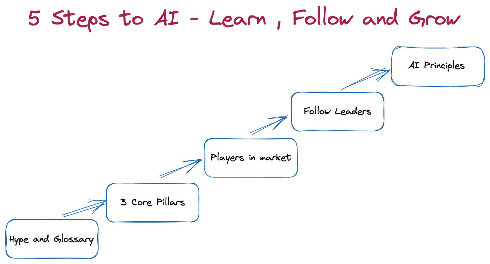

 

### with Machine Learning / Artificial Intelligence

If you have ever wondered 

*   _how do I get myself up to speed with Machine Learning/Artificial Intelligence_ 
    or 
*   _why the hype now for a term artificial intelligence that has existed since 1950s”_

 This post may be helpful for you. I would refer to Machine Learning/Artificial Intelligence as ML/AI for the rest of the post.

There are multiple business challenges in any organization. There could be usecases related to manual human errors, automating a business process, providing better customer service, recommending a product, understanding the sentiment, getting insights on the trends, predicting natural disasters, estimating vehicle damage, analyzing multiple documents for a summary, processing huge amounts of documents, predicting faults/anomalies. the list goes on. The challenges are endless and the technology is ever evolving.  

We are seeing continuous advancements in various fields, but do you have to be hands on to be an expert? Not necessarily. My colleague [Steve Walker](https://www.linkedin.com/in/steve-walker-7473368/) mentioned this once “Do you have to be an expert in the design of an F35 aircraft to fly it or do you have to know just to fly?”. 

[Image from: https://xkcd.com/1838/]

Overnight none of us can/will become Data Scientists, however there is a lot we can learn and grow. 

The job roles vary in a wide spectrum some much needed hands on experience, some having the ability to architect for an Enterprise solution and some in a leadership role for guiding your team through a strategy. 

Mahatma Gandhi once said, “Live as if you were to die tomorrow. Learn as if you were to live forever.”  

Here, I am planning to give you some quick tips on a step-by-step approach towards learning in ML/AI. I will also provide recommendations if you are looking to get a hands-on experience in a follow up post. 

**_Step 0: Understand the definition of ML/AI_**

As per Machine Learning [Glossary](https://developers.google.com/machine-learning/glossary) by Google, below are the definitions provided

**[Artificial Intelligence](https://developers.google.com/machine-learning/glossary#artificial-intelligence)** is _a non-human program or model that can solve sophisticated tasks. For example, a program or model that translates text or a program or model that identifies diseases from radiologic images both exhibit artificial intelligence_. 

_Formally, **[machine learning](https://developers.google.com/machine-learning/glossary#machine_learning)** is a subfield of artificial intelligence. However, in recent years, some organizations have begun using the terms artificial intelligence and machine learning interchangeably._

Often I see the terms are being used as synonyms. 

The example of how I would differentiate is through its usage 

Netflix has recently pitched in an idea of using [Eye Tracking for navigation](https://www.engadget.com/2018-11-07-netflix-eye-nav-iphone-hack-day.html) of screens. This would fall under Artificial Intelligence whereas Netflix using Recommendation Engine to predict your next recommended video would fall under Machine Learning.

Artificial Intelligence is a moving target as technology advancements grow in several fields this would keep evolving, whereas Machine Learning deals with predictive and/or reinforcement behavior.

**_Step 1: Understand the glossary_**

As you would expect, there are many items to know in ML/AI. I would like to highlight the below terminologies for you to get familiarized with.

- Supervised vs Unsupervised vs Reinforcement Learning
- Training vs Evaluation vs Inference
- Chatbots, Natural Language Processing/Understanding/Generation, Sentiment Analysis 

[Priyanka Vergadia](https://twitter.com/pvergadia/status/1356663694780887042?lang=en) walks you through the key things to learn in Machine Learning

If you have time and would like to dig a little deeper, Below are some of the other quick review material to get your hands around the topic. 

[Machine Learning is Fun](https://medium.com/@ageitgey/machine-learning-is-fun-80ea3ec3c471#.cydc21t6q)

[Making friends with machine learning](https://www.youtube.com/playlist?list=PLRKtJ4IpxJpDxl0NTvNYQWKCYzHNuy2xG) 

[Machine Learning Crash Course](https://developers.google.com/machine-learning/crash-course/ml-intro)

[ML Glossary](https://developers.google.com/machine-learning/glossary)

[towardsdatascience.com](https://towardsdatascience.com/) (This is a medium link but has great content to continue following)

*Optional Reading*

[Rules of Machine Learning](https://developers.google.com/machine-learning/guides/rules-of-ml)

[Machine Learning : High Interest Credit Card of Technical Debt](https://research.google/pubs/pub43146/)

[Human Centered Approach to AI](https://pair.withgoogle.com/guidebook/)

**_Step 2: Understand three core pillars_**

For an AI driven solution, there are three core pillars. Data, Algorithms and Compute. For most conversations, understanding the terminology and glossary should be adequate. However, I would like to highlight the most important of them all. 

**Data** fuels algorithms.  Anyone who has worked with ML/AI will tell you it's one of the prime examples for “garbage in and garbage out”. 

If your data fails, none of the sophisticated  models will work. It’s important to understand what is **data exploration, data wrangling, data cleansing, data mining, data transformation**. These concepts are generic, with just a search might help. I liked this [article](https://venturebeat.com/2021/02/25/why-machine-learning-strategies-fail/) from Venturebeat which explains the importance of data for ML/AI as one of the top reasons Why Enterprises fail on their strategy.

Also important to understand how enterprises choose to do data lake/data mart/ data pond/data river or whatever they decide to call it.

**Algorithms** and **Compute** - Though these are one of the core pillars of Machine Learning, this generally comes once the AI/ML project is kicked off. Most times these decisions fall upon the Data Scientist, Data Engineers and Architects based on the use case, security concerns, familiarity with tool stack etc.,

**_Step 3: Understand the players in this market_**

Every cloud provider has their unique strengths in their ML/AI portfolio. But these cloud providers are not the only ones; there are a lot of niche players in the market to keep a watch on. 

Below are just some players offering products for the customers to build on their services. 

[Data Robot](https://www.datarobot.com/), [H2O.ai](https://www.h2o.ai/), [Dataiku](https://www.dataiku.com/),[Alteryx](https://www.alteryx.com/),[Data Bricks](https://databricks.com/)

Besides these companies, there are SaaS providers offering AI solutions for most industries such as Banking, Insurance, Health care, Retail, Manufacturing etc.,

[Symphony Retail AI](https://www.symphonyretailai.com/) - Grocery store with AI

[Mitchell Intelligent Estimating](https://www.mitchell.com/mitchell-intelligent-estimating/) - Vehicle Damage Estimating Platform for Insurance 

[Path AI ](https://www.pathai.com/)- Accurate diagnosis of diseases.

This list goes on and it helps you to understand how large this space really is and also every company focuses on how to make their customer lives easier.

**_Step 4: Follow technologists and leaders in this space_**

There are many technologists in this space, follow them on social media. Most of them post great content for you to follow and understand. I get some recent trends what they are working on and understanding how technology evolves from these players. 

I created a Twitter [list](https://twitter.com/i/lists/1403493802678030342).  Do you have someone you follow? Send them to me so we can create a curated list.

**_Step 5: Understand the principles major technology companies have for their governance_**

During Nov'2019 Apple announced Apple card by Goldman Sachs. There were [claims](https://www.zdnet.com/article/apple-card-issuer-investigated-over-gender-bias-in-credit-algorithm/) suggesting that the credit limit for men was substantially higher than women due to bias in the system. 

As organizations accelerate their adoption journey,there *needs* to be an ethical process on what can and cannot the organizations do. These ethical and responsible principles guide the way how end-user customers are best served without bias, respectful of cultural/social norms, data security and privacy considerations.

Some major companies publicly discuss their AI principles for their product strategy. I have highlighted two large AI players.  

[Google](https://www.blog.google/technology/ai/ai-principles/)

[Microsoft](https://www.microsoft.com/en-us/ai/our-approach?activetab=pivot1%3aprimaryr5)

 As we look to become a more AI centric world, if this fails, we as a community would all fail.

To summarize, I have outlined how you could learn keywords in ML/AI, organizations you need to watch out for, how to keep yourself updated with the recent trends and Responsible AI for product strategy.

Keep learning, keep engaging, always be inquisitive and always be listening.

If you have questions/comments/suggestions, please reach out to me [@kanchpat](twitter.com/kanchpat)