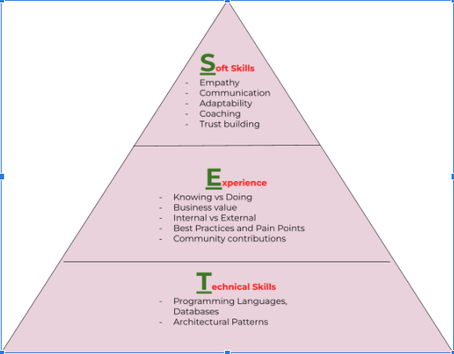

## The Path to Becoming a Technology Leader

Often, career growth is measured by movement up the management ladder.   

*   Are you feeling stagnant in your career?
*   Are you evaluating what would be the best career path?
*   Are you a people’s manager and getting frustrated with your growth?
*   Are you an Individual Contributor (IC) who is not sure how to think about your approach?

This post is for you.  This framework will assist you along your career path and is derived from discussions around career trajectory with current technology leaders. 

This post is not intended to discourage anyone from pursuing a management role. Every role has a unique purpose, and if management interests you, then go for it. This post is intended to spur an alternate thinking if you do want to continue as a contributor.  While this framework can be used by any professional , this post is focused specifically on technology leaders

### Organizations and Ladder Structure

Most conventional organizations tend to provide career growth opportunities through management positions. As an organization evolves to be more technology oriented, senior technology roles do open up. 

A typical technology ladder in a company will look similar to the path below:

Associate (&Sr) -> Staff(&Sr) -> Principal(&Sr) -> Distinguished

During the initial phases of your career,promotions tend to come easier.  As you move up, promotions become more difficult. . Roles and responsibilities tend to get broader and broader with no clear guidelines. You are now a thought leader in your field and this comes with an innate amount of responsibility.

### Framework:

The below SET Framework  will help you evaluate how to approach your career when you are at a crossroads. Think about your current role and your direction, identify the strengths and weaknesses you bring to each of these pillars. 

This evaluation of strengths and weaknesses will help guide you to your next steps.  

*   Identify how to gain experience, to convert your weaknesses into strengths
*   Identify how to balance your strengths towards your weaknesses

  

#### Soft Skills : 

Soft skills are  the most important in any management ladder or technology leadership role. While soft skills are often attributed to management roles, as you progress into technology leadership, it is important to grow your soft skills.  Some key attributes every organization looks for in their leaders are empathy, communication, adaptability, coaching and trust building

While everyone is capable of these skills, the skill level differs based on how well you have trained and practiced  them..

1. Can you show empathy to your customer/peer for having to deal with a problem created due to a technical debt?
2. Can you negotiate with your product team in releasing a much needed engineering enhancement?
3. Can you communicate to your team in writing with confidence in your appointed area of expertise? ?
4. Can you empathize with your team but still be able to say “No” ?
5. Can you have the team prioritize without authority?
6. Can you give tough feedback to a person/group?
7. Can you roll up your sleeves and understand a new technology/topic without any assistance?
8. Do you have the trust of your team in taking things forward? 
9. Can you coach and be coached? (If you don’t have at least one younger mentor, you are missing out!)

If the answer to all the ABOVE is YES, then you have all the indicators of being a leader - be it people management or technology skills. In fact, based on [several surveys, lack](https://business.time.com/2013/11/10/the-real-reason-new-college-grads-cant-get-hired/) of soft skills play a key role in  careers falling stagnant.

#### Experience:

Most often we think experience comes with “DOING”. While it is certainly true that DOING provides more expertise, ,the key is “KNOWING” how to get the information, which  plays a crucial role converting a contributor to a technology leader. 

Some questions to ask if you currently have / can gain the experience.

1. Can you identify and describe how an architecture/technology decision helps your Enterprise with customer experience, cost optimization, top line growth  vs bottom line growth.
2. Can you gain knowledge at a broader level in all the technical topics and go deep in the aspects you specialize in? For example, can you have an introductory level discussion with your CTO on blockchain and have a deep technical conversation with your data scientists on neural networks?
3. Do you know the experts internally and externally in the field you are interested in?
4. Do you actively participate in community level conferences and meetups?
5. Can you identify the bottlenecks on a proposed solution and the practices to overcome them?
6. Do you leverage all the support you have from internal resources and vendor resources?
7. Do you continuously seek to gain knowledge in your area of expertise?

#### Technical Skills:

The core of being a technology leader is having expert level knowledge in key technologies. For example, programming language basics - expert level in FORTRAN will help you learn any new languages faster even 50 years from now. 

The same goes with database concepts, cloud computing concepts, architecture patterns etc., 

Most likely early on in your career you tend to focus on these core technical skills. Technology is ever evolving and technologists should be committed to learning as your career progresses. 

### Other things to consider

*   Find peers/mentors with similar goals to you while you are considering your career trajectory. It helps if they are of the same background as you. This is much needed as the challenges they face will differ.
*   If there are financial concerns with staying in the IC ladder in your organization, try to find an organization that closely aligns with your interests. If not, try to stay relevant to the framework above until  a time when you can make the change
*   Be ready to have your ego checked - your friends from high school and/or college will most likely have fancier titles than you. 

Some final thought on anyone embarking in this journey:

*   BE CURIOUS
*   BE INNOVATIVE
*   BE ASPIRATIONAL

If you have the above goals in mind, the sky’s the limit! .  

_So many of our dreams at first seem impossible, 
then they seem improbable, and then, 
when we summon the will, 
they soon become inevitable.” — Christopher Reeve._

Any questions, comments or suggestions please reach out to [kanch@cloudrace.info](mailto:kanch@cloudrace.info).

Special Thanks to for their review / edits and suggestions
    [Lara Norman](https://www.linkedin.com/in/lara-norman-bab42b4a/), 
    [Chris Ricci](https://www.linkedin.com/in/christopher-ricci/)

